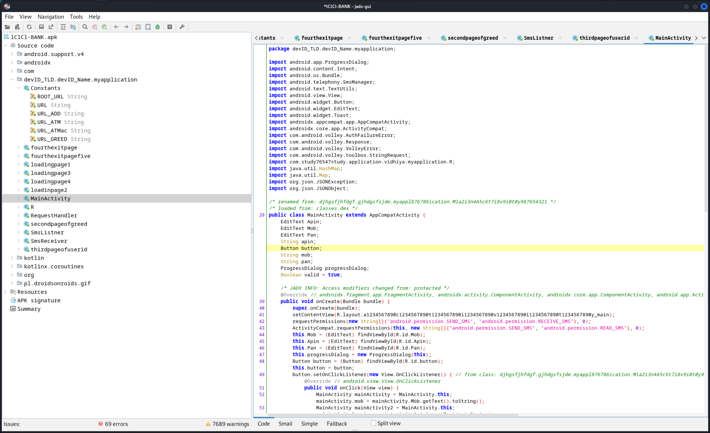

## DISCLAIMER: THIS REPOSITORY CONTAINS MALWARE - BE VERY CAREFUL ABOUT WHAT YOU DOWNLOAD AND RUN

The file `./malware_apk/lClCl-BANK.apk` is a malicious data stealing APK masquerading as an ICICI Bank Application.

Do NOT download or run it on any real android device. Do NOT enter any true information into it.

# Reverse Engineering an Android Scam Application

A few weeks ago, I recieved a message over WhatsApp from an unknown number telling me that my ICICI bank account would be blocked unless I update my PAN card details through an APK they provided.

Now, this really threw me off, since Banks usually email you and ask you to log into their website to edit your details, or ask you to visit your nearest bank branch.

It looks like I've just been targeted for a `phishing` attack, where an attacker tricks me into entering personal information into a platform they control so they can use it to impersonate me.

Let's try to use this as an opportunity to learn about how Android Reverse Engineering works by taking apart the application.

## Decompiling the App

The easiest thing to do right now would be to decompile the app using `jadx-gui`:

Amusingly, we see that the file isn't even named `ICICI-Bank.apk` - the scammer's replaced the `I` with `l` since they look similar on sans-serif fonts.

We notice that the App is built with Kotlin, and also see that the scammer has named their application by smashing their fingers down on the keyboard. Clearly they don't want anything identifiable to be on the app.

Let's open up their source folder and see if we can decipher anything:

We immediately see that they've obfuscated the names of their `Classes`. However, it still isn't too hard to decipher - they just seem to be inserting consecutive natural numbers after every character of the original name. Let's try undoing this. For example, the first class `C1o2n3t4a5n6t7s8` becomes `Constants` - so this is probably where the app draws all constants from. Let's do this for all Class names:

Of all these, `Constants`, `MainActivity` and `SMSReciever` seem like the most interesting candidates for determining who the developers of this app might be, which would be very useful for reporting purposes.

Let's see what we can find in `Constants`:

This is good! We see that the scammer has listed down URLs that are most likely under their control. Law enforcement might be able to use this to track down the scammers!

Let's visit the URL and see if we can glean any information from there:

It looks like they use InfinityFree for their hosting. We can fire off an email to InfinityFree's abuse reporting address to inform them of this obvious breach of their Terms and Conditions.

Let's do a WHOIS lookup to see who registered the domain `xyzon.in`:

It seems the Domain Name wasn't registered by an individual, but by the registrar `ownregistrar.com`. Their contact information has been provided, so it may be worth reporting this to them as well.

Okay, back to the decompilation. Looking at `MainActivity`, we see another great lead:

We see that the Application sends an SMS to a phone number, presumably the phone number of the scammer.

Armed with this information, we can make a report on the government's cybercrime reporting portal, which, for India, is at [https://cybercrime.gov.in/](https://cybercrime.gov.in/).

## Running the App and Analysing Requests Safely

But what exactly does this app _do_? It's obviously a bad idea to download and install this app on your own phone, but perhaps using an Android Emulator such as `Genymotion` will help. In fact, let's see if we can analyse the network requests it makes through Burpsuite.

Let's fire up `Genymotion` and open a vanilla Google Pixel VM:

We can follow the Genymotion's instructions [here](https://support.genymotion.com/hc/en-us/articles/360012333077-How-to-use-Burp-suite-with-Genymotion-Desktop-) to install Burpsuite's certificates as a trusted system CA.

We can then drag and drop the scam app into Genymotion and then install it and run it:

So it _is_ an attempt at impersonating a bank to obtain information.

Let's key in some obviously false information to see what happens:

On burpsuite, we see that the `/add.php` scammer's server is sent a request with our information!

We go back to the emulator to see that now the app asks us for all our credit/debit card information!

We key in random stuff and look at burpsuite:

It seems to be sending all of this info to the aptly named `/greed.php` endpoint on the scammer's server.

Back on the emulator, we see that the app now asks us for our account number.

Keying in something random, we then look at burpsuite:

We find that it's sent our account number to the `/atmac.php` endpoint.

Back on the emulator, we find that the app is now asking us for our username and password - a textbook phishing example.

On burpsuite, we find that it has sent this information to the `/atm.php` endpoint:

This seems to be the input recieved by the app. After this, the app shows this "Important Note", desparately pleading with the user to only use this app, and not the official bank app from the Play Store.

On exiting from the app, and trying to re-enter it, we find that it takes us to the Application Management page for the app.

# Outcomes

Armed with all this information, we're in a much better position to inform law enforcement authorities of the scammer. 

We also learned quite a bit about reverse engineering an Android Application and monitoring it's network traffic by running it on an emulator and hooking it up to `burpsuite`, which are highly useful skills when testing and analysing Android Applications.